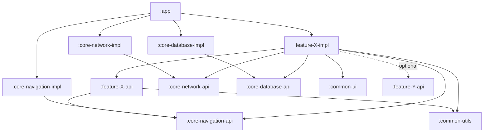

# Архитектура приложения Cats Cafe

Документ верхнеуровневый: фиксирует слои, правила зависимостей и шаблоны модулей. Список конкретных feature-модулей будет добавляться итеративно.

---

## 1. Базовые принципы

- **Clean Architecture** внутри каждого feature-модуля: слои `presentation` → `domain` ← `data` (зависимости направлены к `domain`).
- **MVVM** в `presentation`: `Screen (Composable)` ↔ `ViewModel` ↔ `UseCase`. ViewModel обрабатывает все действия через единственный метод `fun onEvent(event: UiEvent)`; состояние — `StateFlow<UiState>`.
- **Feature-first**: каждый экран или самостоятельный функционал — отдельный gradle-модуль.
- **api / impl split**: любой модуль, который что-то предоставляет наружу, делится на `*-api` (контракты) и `*-impl` (реализация). Включая каждую фичу-экран.
- **Inversion of Dependencies**: на `*-impl` зависит только `:app` (для подключения реализаций в DI-граф).
- **DI: Koin**, по одному `Module` на gradle-модуль; финальная сборка в `:app`.

Технологический стек: Koin, Retrofit, Compose, Compose Navigation (type-safe), Room, kotlinx-serialization.

---

## 2. Верхнеуровневая структура

Дерево каталогов = иерархия gradle-модулей (path-based, без `projectDir` overrides):

```
app/                                            :app
common/
   common-ui/                                   :common:common-ui
   common-utils/                                :common:common-utils
core/
   core-network/
      core-network-api/                         :core:core-network:core-network-api
      core-network-impl/                        :core:core-network:core-network-impl
   core-database/
      core-database-api/                        :core:core-database:core-database-api
      core-database-impl/                       :core:core-database:core-database-impl
   core-navigation/
      core-navigation-api/                      :core:core-navigation:core-navigation-api
      core-navigation-impl/                     :core:core-navigation:core-navigation-impl
feature/
   <screenName>/
      <screenName>-api/                         :feature:<screenName>:<screenName>-api
      <screenName>-impl/                        :feature:<screenName>:<screenName>-impl
```

`common` — всё переиспользуемое между фичами (включая UI-kit и темы). `core` — технические инфраструктурные модули (сеть, БД, навигация). `feature/<screenName>/` — папка фичи: внутри `<screenName>-api` и `<screenName>-impl`.

В корне:
- [`settings.gradle.kts`](settings.gradle.kts) подключает все модули через `include(":...")` и включает type-safe project accessors (`projects.feature.screenX.screenXApi`).
- [`gradle/libs.versions.toml`](gradle/libs.versions.toml) — единый version catalog (Koin/Retrofit/Room/kotlinx-serialization/Compose Navigation/KSP).
- [`build-logic/`](build-logic) — included build с convention plugins (`cats.android.application`, `cats.android.library`, `cats.android.library.compose`). Каждый модуль подключает один из них вместо повторяющейся конфигурации `compileSdk`/`minSdk`/`compileOptions`/`kotlinOptions`.

---

## 3. Правила зависимостей

- `*-api` модули зависят **только** от `common-*` и других `*-api`. Без Retrofit / Room / тяжёлых зависимостей.
- `*-impl` модули зависят от:
  - своего `*-api`,
  - `common-*`,
  - `core-*-api` (никогда от `core-*-impl`),
  - `feature-*-api` других фич, если нужно открывать чужие экраны.
- `feature-*-impl` **не зависит** от других `feature-*-impl`.
- `:app` зависит от всех `*-impl` (чтобы Koin собрал реализации) и от `*-api` транзитивно.
- `common-ui` не зависит от `core-*` и `feature-*`.



---

## 4. core-модули

### 4.1 core-network

- **api**: `sealed interface ApiResult<out T>` (`Success` + `Failure.{Http, Network, Timeout, Serialization, Unknown}`), обёртка `suspend inline fun <T> apiCall(block: suspend () -> T): ApiResult<T>` (ловит исключения Retrofit/OkHttp/kotlinx-serialization). Транзитивно отдаёт `retrofit2`, `kotlinx-serialization-json` и `okhttp3` как `api`-зависимости — поэтому `feature-X-impl` может объявлять свои Retrofit-сервисы и `@Serializable` DTO без явного добавления этих библиотек.
- **impl**: `NetworkConfig` (baseUrl, isDebug, таймауты), `OkHttpClient` (с `HttpLoggingInterceptor` BODY только в debug), корневой `Retrofit` с `Json.asConverterFactory("application/json")`, единый `Json` (`ignoreUnknownKeys`, `coerceInputValues`, `explicitNulls = false`), Koin-модуль `coreNetworkModule(config: NetworkConfig)`.

`baseUrl` приходит из `BuildConfig.BASE_URL` (`buildConfigField` в `:app/build.gradle.kts`, отдельные значения для debug/release). `:app` собирает `NetworkConfig(BuildConfig.BASE_URL, BuildConfig.DEBUG)` и передаёт в `coreNetworkModule(...)` при `startKoin`.

Feature-impl/data:
1. Объявляет свой `interface CatApi { @GET("cats") suspend fun ... }` и `@Serializable data class CatDto`.
2. В Koin-модуле фичи: `single { get<Retrofit>().create(CatApi::class.java) }`.
3. В репозитории: `apiCall { api.getCats().map(CatDto::toDomain) }` — получает `ApiResult<List<Cat>>`, маппит в свой domain-`Result` или sealed.

Auth-инфраструктура (Bearer-токен) появится вместе с `:feature:auth:*` — добавим `AuthTokenProvider` в `core-network-api` и `AuthInterceptor` в `core-network-impl` без правок остальных фич.

### 4.2 core-database

Одна общая `CatsCafeDatabase` для всего приложения (single-DB подход).

- **api**: публичные `@Entity`-классы и `@Dao`-интерфейсы. Зависит на `room-runtime` и `kotlinx-datetime` (типы публичных полей `Instant`/`LocalDate`). Не зависит на `room-compiler`. `feature-X-impl`-data импортирует здесь нужные DAO/Entity и работает с ними как с обычными интерфейсами.
- **impl**: `CatsCafeDatabase : RoomDatabase` со списком всех `entities`, `@TypeConverters(CatsCafeTypeConverters::class)`, миграции, `DatabaseConfig` (имя файла, версия), Koin-модуль `coreDatabaseModule`. Здесь же KSP подключает `room-compiler` и генерит реализации DAO. Каждый DAO выставляется в Koin как `single { get<CatsCafeDatabase>().xxxDao() }`.

Принципиальные правила:

- `feature-X-api` **не** зависит от `core-database-api` и **не** видит ни `Entity`, ни `Dao`. Domain-модели/use-cases работают с domain-типами, маппинг `Entity ↔ domain` живёт в `feature-X-impl`-data.
- Появление новой `Entity` требует:
  1. Добавить `@Entity` и `@Dao` в `core-database-api`.
  2. Включить класс в `entities = [...]` у `@Database`.
  3. Поднять `DatabaseConfig.VERSION` и добавить `Migration`.
  4. Зарегистрировать DAO в `coreDatabaseModule`.

TypeConverters: `Instant` (epoch millis), `LocalDate`/`LocalDateTime` (ISO-строки), `UUID` (строка) — лежат в `core-database-impl/converters/CatsCafeTypeConverters.kt`.

### 4.3 core-navigation

Type-safe Compose Navigation 2.8+ на `kotlinx-serialization`.

- **api**: контракт `interface ScreenProvider { fun NavGraphBuilder.register(navController: NavController) }`; абстракция `interface AppNavigator { fun navigate(route: Any); fun popBackStack() }`. Здесь живёт **только** контракт сборки графа — другие фичи в этот модуль не заглядывают.
- **impl**: реализация `AppNavigator` поверх `NavController`; `NavHostBuilder` собирает через Koin `getAll<ScreenProvider>()` и вызывает `register(...)` у каждого; стартовый маршрут задаётся в `:app`.

Принципиальное решение: **`ScreenProvider` НЕ выставляется в `feature-X-api`**. Другим фичам он не нужен — им достаточно `Route` data class и `AppNavigator.navigate(route)`. Это позволяет держать `feature-X-api` без транзитивной зависимости на `navigation-compose` (и, как следствие, на `compose-runtime`).

Пример объявления экрана в `feature-X-api` (только Route):

```kotlin
@Serializable
data class CatDetailsRoute(val catId: String)
```

В `feature-X-impl` живёт реализация `ScreenProvider`, которая регистрирует `composable<CatDetailsRoute> { ... }` и поднимается в Koin как `single<ScreenProvider> { ... }`. Это деталь реализации фичи; `core-navigation-impl` подберёт её через `getAll<ScreenProvider>()`.

---

## 5. Шаблон feature-модуля

```
:feature:feature-<name>:
   :feature-<name>-api
      Route data class (@Serializable)        ← всё, что нужно другим фичам
      Публичные доменные модели/контракты     ← если есть
   :feature-<name>-impl
      presentation/
         screen/        Composable
         viewmodel/     ViewModel (StateFlow<UiState>, intents)
         model/         UiModel, UiState, UiEvent
         navigation/    реализация ScreenProvider (internal)
      domain/
         model/         доменные модели
         repository/    интерфейсы репозиториев
         usecase/       UseCase
      data/
         remote/        Retrofit-сервис, DTO, mapper
         local/         DAO (если нужно), Entity, mapper
         repository/    реализация репозитория
      di/               KoinModule (single<ScreenProvider> { ... })
```

`feature-X-api` намеренно пустой по зависимостям: только `kotlinx-serialization-core` и (опционально) `:common:common-utils`. Никакого `navigation-compose`, никакого Compose UI.

Правило слоёв: `presentation` → `domain` ← `data`. `domain` ничего не знает про Android, Retrofit, Room, Compose.

---

## 6. DI (Koin)

- Каждый модуль предоставляет публичный `val xxxModule: Module`.
- ScreenProvider регистрируется в общий список:

```kotlin
single<ScreenProvider> { CatDetailsScreenProviderImpl(get()) }
```

В `core-navigation-impl` через `getAll<ScreenProvider>()` все экраны регистрируются в `NavHost`. `:app` стартует Koin со списком всех модулей.

---

## 7. Что фиксируем сейчас, а что — позже

**Сейчас (готово):**
- Документ архитектуры (этот файл).
- `gradle/libs.versions.toml` с версиями стека.
- `settings.gradle.kts` с `include` всех модулей и `includeBuild("build-logic")`.
- `build-logic/` с convention plugins.
- Скелеты модулей `:common:*`, `:core:core-network:*`, `:core:core-database:*`, `:core:core-navigation:*` с тонкими `build.gradle.kts` (без `AndroidManifest.xml` — AGP 8+ генерирует его автоматически по `namespace`).
- `:app` подключает все `*-impl` и `koin`.
- Правила зависимостей и api/impl-границы (`.cursor/rules/`).
- Папка `feature/` с `README.md` — шаблон создания новой фичи.

**Текущий список фичей (скелеты созданы):**

| Фича | Маршрут | Кто навигирует |
|------|---------|----------------|
| `feature/splash` | `SplashRoute` | стартовый экран в `:app` |
| `feature/auth` | `AuthRoute` | splash, profile (logout) |
| `feature/home` | `HomeRoute` | splash/auth, таб |
| `feature/catalog` | `CatalogRoute` | таб |
| `feature/booking` | `BookingRoute(preselectedCatId)` | таб, cat-details |
| `feature/profile` | `ProfileRoute` | таб |
| `feature/cat-details` | `CatDetailsRoute(catId)` | catalog |

Все 14 модулей (7 api + 7 impl) подключены в `settings.gradle.kts`. Каждая фича пока содержит только `Route` (api) и `ScreenProvider`+`Screen`-заглушку+`featureXModule` (impl). MVVM (`ViewModel`/`UiState`/`UiEvent`) добавляется при появлении логики — шаблон в `feature-impl.mdc`.

**К ближайшим шагам:**
- Bottom navigation для `Home`/`Catalog`/`Booking`/`Profile` (Scaffold с `BottomBar`, переключение через `popUpTo` + `saveState`/`restoreState`).
- Логика Splash → `Home`/`Auth`.
- Первая сущность в `core-database-api` → активация `CatsCafeDatabase`.

**Позже:**
- `AuthTokenProvider` + `AuthInterceptor` вместе с `:feature:auth:*`.
- Стратегия многомодульного тестирования.
- Аналитика, фича-флаги, error reporting — как отдельные `core-*`.
